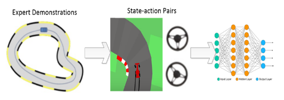

---
title: Teaching an Artificial Agent to Play CarRacing Game 
summary: Deep reinforcement learning, imitation learning  
tags:
- RL

date: "2021-08-23T00:00:00Z"

# Optional external URL for project (replaces project detail page).
external_link: "" 

links:
- name: Report
  url: https://ling-k.github.io/uploads/Kong_Xu_CS5180_Project_Report_new.pdf
url_code: ""
url_slides: "https://ling-k.github.io/uploads/Kong_Xu_CS5180_Project_slides.pdf"
url_video: "https://www.youtube.com/watch?v=vR4T4orNpzU" 

--- 

This project aims at dealing with decision making problems in autonomous driving by applying deep reinforcement
learning and behavioral cloning algorithm in a simulated car
racing environment. To be specific, we will implement deep
reinforcement learning algorithms (Proximal Policy Optimization) and behavioral cloning algorithm (DAGGER) and
use them to teach an agent car to play the CarRacing game.
As a deep reinforcement learning algorithm, Proximal
Policy Optimization directly optimizes the cumulative reward without using a value function, and it is able to be
trained directly with nonlinear function approximations such
as neural networks. Dataset Aggregation is an efficient way
to reproduce the expert demonstrated behavior. Expert data
will first be obtained by some well-trained expert. Then, the
state and actions made by the expert will be recorded at the
same time. Our goal for behavioral cloning is to teach an
agent to play the game using expert demonstrated data.

As shown in the figure below, For traditional behavior cloning, we first collect expert demonstration data, and use it to learn a policy mapping from states to actions. However, there are some problems with this method. Expert only samples limited obersavations or, states, so the policy will make big mistakes when the agent goes to a state that has not been encountered before.

One solution for this problem is Dataset aggregration, or dagger.  The idea of dagger is that we use our learned policy to interact with the enviornment, and record the states and the action under expert policy. Then we add the new data to the dataset, and use the new dataset to train our new policy. It is just like iterative version of behavior cloning.

   
