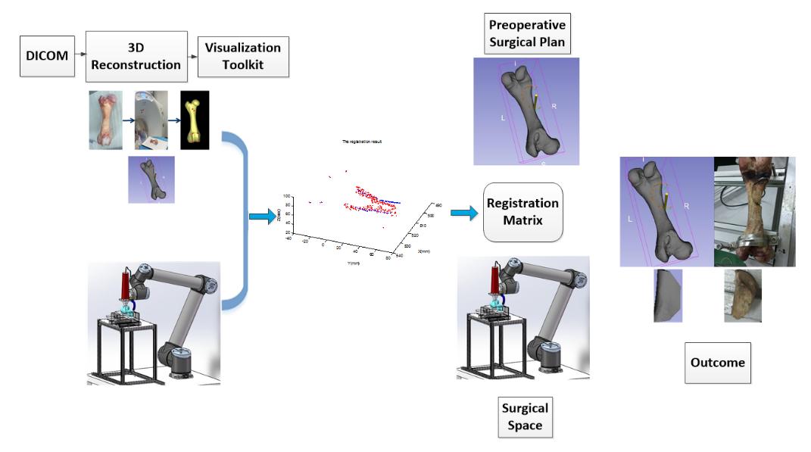

The conventional human-performed surgery of bone tumor resection has the drawbacks of imprecise, high labor intense on surgeons, longer recovery time. In this project, a surgical robot system for bone tumor resection is developed. First, the preoperative image of experimental bone is obtained by CT scanning. Then the surgeon is able to plan a surgery path by means of choosing key points on the 3D bone model. Second, the relationship between image space and surgical space is established. Finally the surgery path made by the surgeon in image space is mapped to surgical space and robot can receive the commands to operate the surgery. Meanwhile, the position of the surgical tool is displayed in image space in real time. Acetabular bone and thigh bone trials were performed at hospital and the outcome shows the feasibility of using robot to resect bone tumor.

     
More details: [ Report ](https://ling-k.github.io/uploads/Report-Image-Guided-Surgical-Robot.pdf), [ Slides ](https://ling-k.github.io/uploads/surgical_robot_project_slides.pdf),  [ Video ](https://www.youtube.com/watch?v=vR4T4orNpzU).

